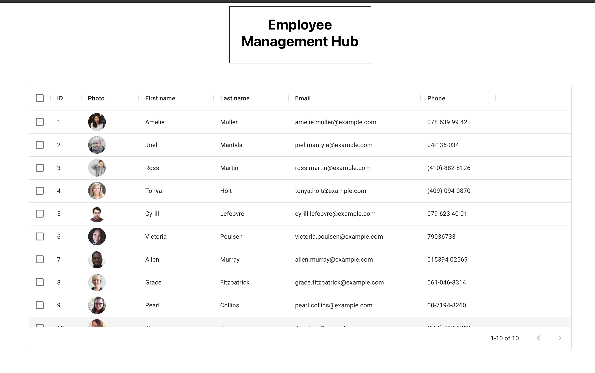
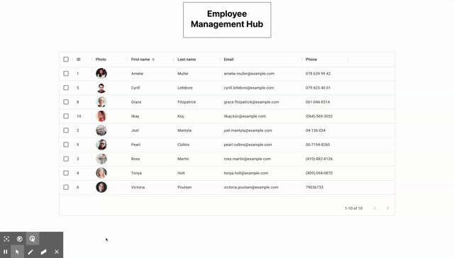

# Management Hub

## Table of Contents 
[Description](#description)  
[Technologies](#technologies)  
[Installation](#installation)  
[Usage](#usage)  
[Links](#links)  
[License](#license)  
[Questions](#questions)  

## Description
Built for the purpose of helping soldify my understanding of foundational React principles, this app lets you view your employee directory & get the most relevant info at a glance with a simple, clean layout.  

## Technologies
* JavaScript
* React
* Material UI
* [Random User API](https://randomuser.me/)

## Installation
Clone and/or fork the repo (see how [here](https://docs.github.com/en/desktop/contributing-and-collaborating-using-github-desktop/cloning-and-forking-repositories-from-github-desktop)), then install dependencies by running the following in your command line: 
``` bash
npm --i
```

## Usage
### Static View


### Live Demo


## Links
* [GitHub Pages](https://emblair96.github.io/management-hub/)

## License
Copyright &copy; Licensed under the MIT license.

## Questions
Contact me at emilyblair96@gmail.com with questions.  If you find something that could be improved about this application, you can submit an issue on GitHub [https://github.com/emblair96](https://github.com/emblair96).
